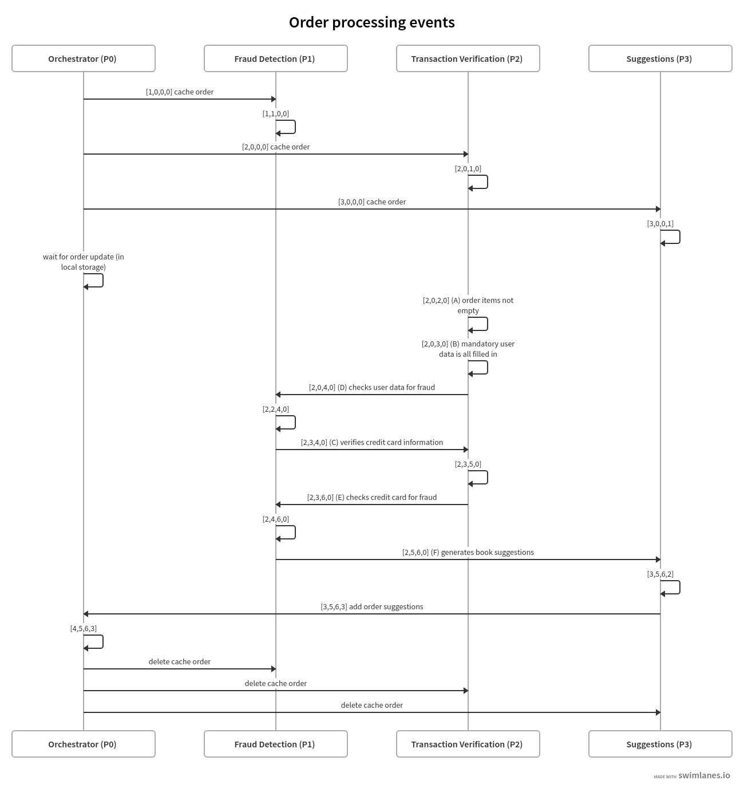

# Documentation

This folder should contain your documentation, explaining the structure and content of your project. It should also contain your diagrams, explaining the architecture. The recommended writing format is Markdown.

## System diagram

## Architecture diagram

## Vector diagram

## Order executor state diagram

## Order executor component diagram (token ring)

## Sequential consistency diagram (WRITE)

## Sequential consistency diagram (READ)
